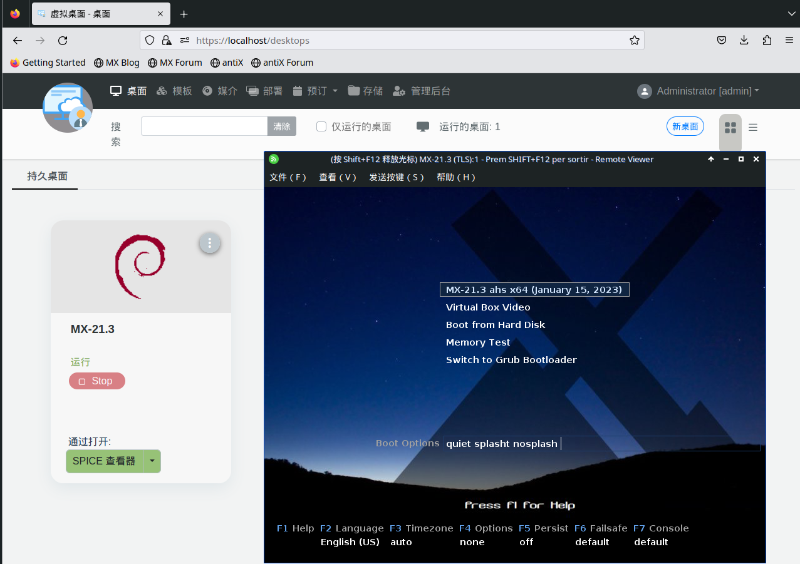
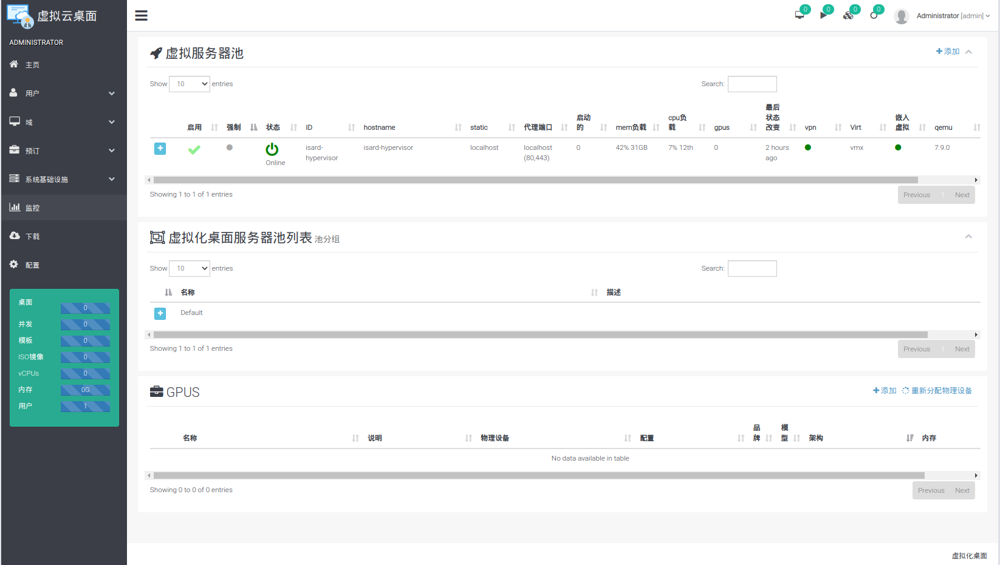

# D-VDI 云桌面

 D-VDI云桌面是先进的桌面虚拟化软件，其特点为:

- **GPU支持**: 支持Nvidia GPU 虚拟化
- **容易安装**: 使docker和docker compose，可以在分钟内部署
- **可扩展**:您可以管理多个虚拟机管理程序并根据需要添加/删除它们
- **快速**: 几秒钟内创建和连接桌面
- **Versatile**:您可以运行 QEMU/KVM 支持的所有操作系统，并且支持多个查看器：
  + *SPICE*
  + *noVNC* (web)
  + *RDP*
  + *Guacamole RDP* (web)

D-DVI云桌面示例ISO，百度网盘链接: https://pan.baidu.com/s/1RB5vnFpfOPGcWy1Es7T5FQ?pwd=vxs6 提取码: vxs6 

用户名：admin

密码：admin@cecd

D-VDI云桌面开发时使用的docker镜像环境，百度网盘链接: https://pan.baidu.com/s/1MC5nCBXHCo2FwZc_RDka7A?pwd=3qiq 提取码: 3qiq 

D-VDI云桌面使用文档，百度网盘链接:  https://pan.baidu.com/s/1rB-kcnYVxiZkqih1JXRu5w?pwd=c7t3 提取码: c7t3 

前端界面：

后端界面：

